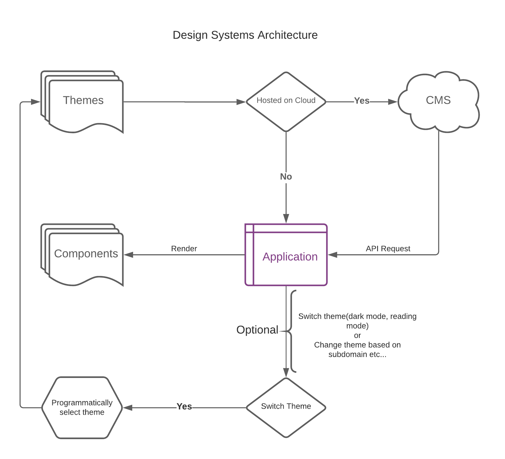

# axis <i>Beta</i>

> Theme based React Styled Component Library

> **_WARNING ⚠️ :_** This library is still in beta, future commits might break the exsisting code!

[](https://www.npmjs.com/package/@therise3107/axis) [](https://standardjs.com)

## Introduction

Axis is a theme-based component library that supports SSR by default. Axis is fully responsive and extensible. The main philosophy of Axis is driving the styling of your application via themes, which can be either shipped within your code or CMS or your server. Here is the detailed flow of Design Systems Architecture




## Motivation

The recent trend of driving your styling from JavaScript has been the motivation behind true component-level design. However, I have always felt there is room for more abstraction and decoupling of the styling from the application code. The usage of headless CMS to drive the content motivated me to write a library that can be flexible enough to serve your styling from your CMS or server and still be very modular, flexible, and extensible. Axis is an attempt to decouple the mixing of javascript and CSS to furtherance with the composite theme that is responsible for styling your UI.


## Why Axis

Mixing CSS in the codebase increases the complexity, code repetition, and reduces the extensibility of your application. Axis acts as a bridge in enabling you with the bespoken component level architecture of Html elements which can we used as a replacement of regular Html component and whose styling is driven through the theme. This gives the developer more time to focus on improving other areas like logic, UI, and performance.

Another important feature is Axis is enabling non-developer to change the theme from your CMS or any remote server (if you are hosting your theme there) which means 0 downtimes for your application and the same website can be used with multiple themes.

## Theming in Axis

Theming is a simple javascript file that exports styling objects which are used by specific components to manipulate styling based on the theme object. Consider theme as a collection of objects which can be changed based on the props. Please refer to the default [theme](https://github.com/CollegeDevs/axis/blob/master/src/styles/theme.js) file for more information.


## Install

```bash
npm install --save @theise3107/axis
```

or

```bash
yarn add @theise3107/axis
```

## Usage
Axis exposes components which can be used as drop in or can be extended as per your custom theme.

```jsx
import React from 'react'

import { ThemeProvider, Container } from 'axis'

/* Optional
  import your theme

  <ThemepProvider theme={theme}>...
*/

const Root = ({ children }) => (
  <ThemeProvider>
    <Container>
      {children}
    </Container>
  </ThemeProvider>
)
```

## Themeing

Theming is the essensital to your application. Think of theme as a simple object changing of which will change the look and feel of your application, without you having to make changes in your code.

Axis handles theming via a theme object, which must have following properties, however you can customize their sub properties. For proper example, you should refer to the [theme](https://github.com/CollegeDevs/axis/blob/master/src/styles/theme.js)

### Handling multiple themes

If your application needs to show different themes for different url or simply dark-mode, read-mode etc, you can do somthing like that:

1. Exract the common properites in default theme
2. [Deepmerge](https://github.com/TehShrike/deepmerge) the selected theme with default theme
3. Pass it down to axis.

## Contributing

Please fork and clone the repository, run `yarn install && yarn start` in main folder. Cd to example folder run `yarn install && yarn start`, browse to localhost:3000 and you can test your changes in real time.

Please feel free to provide suggestions, and how we can improve the readme and code.

## License

MIT © [therise3107](https://github.com/therise3107)
